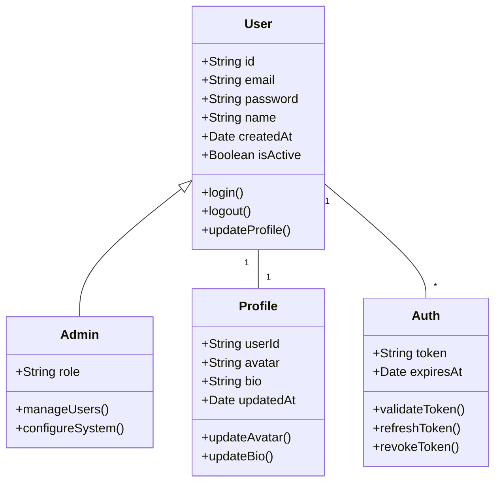

```mermaid
classDiagram
    class User {
        +String id
        +String email
        +String password
        +String name
        +Date createdAt
        +Boolean isActive
        +login()
        +logout()
        +updateProfile()
    }

    class Admin {
        +String role
        +manageUsers()
        +configureSystem()
    }

    class Profile {
        +String userId
        +String avatar
        +String bio
        +Date updatedAt
        +updateAvatar()
        +updateBio()
    }

    class Auth {
        +String token
        +Date expiresAt
        +validateToken()
        +refreshToken()
        +revokeToken()
    }

    User <|-- Admin
    User "1" -- "1" Profile
    User "1" -- "*" Auth
```

## 클래스 다이어그램 설명
- User를 중심으로 한 주요 클래스들의 관계를 표현했습니다.
- Admin은 User를 상속받아 추가 권한을 가집니다.
- Profile은 User와 1:1 관계를 가집니다.
- Auth는 User와 1:N 관계를 가집니다.