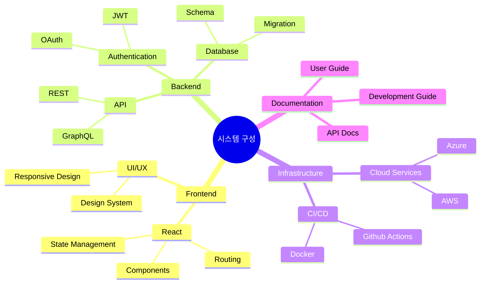

```mermaid
mindmap
  root((시스템 구성))
    Frontend
      React
        Components
        Routing
        State Management
      UI/UX
        Design System
        Responsive Design
    Backend
      API
        REST
        GraphQL
      Database
        Schema
        Migration
      Authentication
        JWT
        OAuth
    Infrastructure
      Cloud Services
        AWS
        Azure
      CI/CD
        Github Actions
        Docker
    Documentation
      API Docs
      User Guide
      Development Guide
```

## 마인드맵 설명
- 시스템의 주요 구성 요소를 계층적으로 표현했습니다.
- Frontend, Backend, Infrastructure, Documentation의 4개 주요 영역으로 구분됩니다.
- 각 영역별 세부 기술 스택과 구성 요소를 포함합니다.