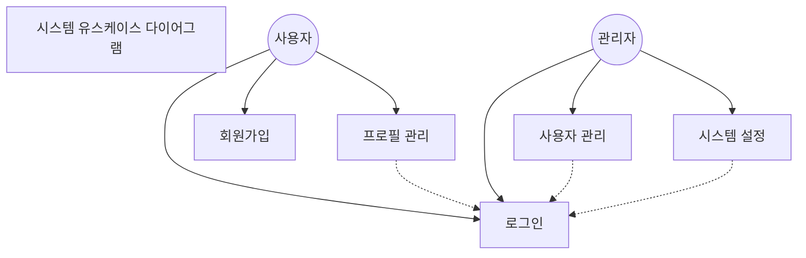

```mermaid
graph TD
  title[시스템 유스케이스 다이어그램]

  %% Actors
  User((사용자))
  Admin((관리자))

  %% Use Cases
  UC1[로그인]
  UC2[회원가입]
  UC3[프로필 관리]
  UC4[사용자 관리]
  UC5[시스템 설정]

  %% Relationships
  User --> UC1
  User --> UC2
  User --> UC3
  Admin --> UC1
  Admin --> UC4
  Admin --> UC5

  %% Extensions
  UC3 -.-> UC1
  UC4 -.-> UC1
  UC5 -.-> UC1
```

## 유스케이스 다이어그램 설명
- 시스템의 주요 액터는 일반 사용자와 관리자입니다.
- 모든 기능은 로그인이 선행되어야 합니다.
- 관리자는 사용자 관리와 시스템 설정 권한을 가집니다.
- 일반 사용자는 회원가입과 프로필 관리가 가능합니다.