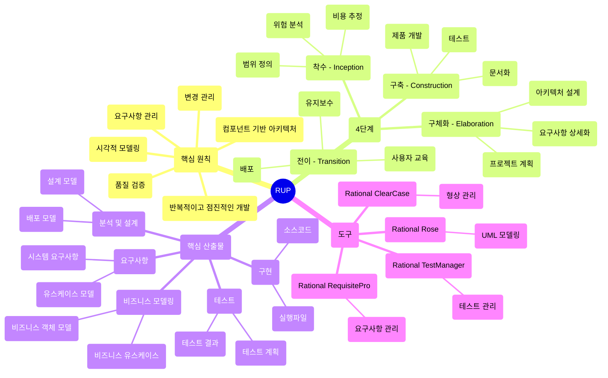

```mermaid
mindmap
  root((RUP))
    (핵심 원칙)
      (반복적이고 점진적인 개발)
      (요구사항 관리)
      (컴포넌트 기반 아키텍처)
      (시각적 모델링)
      (품질 검증)
      (변경 관리)
    (4단계)
      (착수 - Inception)
        (범위 정의)
        (비용 추정)
        (위험 분석)
      (구체화 - Elaboration)
        (아키텍처 설계)
        (요구사항 상세화)
        (프로젝트 계획)
      (구축 - Construction)
        (제품 개발)
        (테스트)
        (문서화)
      (전이 - Transition)
        (배포)
        (사용자 교육)
        (유지보수)
    (핵심 산출물)
      (비즈니스 모델링)
        (비즈니스 유스케이스)
        (비즈니스 객체 모델)
      (요구사항)
        (유스케이스 모델)
        (시스템 요구사항)
      (분석 및 설계)
        (설계 모델)
        (배포 모델)
      (구현)
        (소스코드)
        (실행파일)
      (테스트)
        (테스트 계획)
        (테스트 결과)
    (도구)
      (Rational Rose)
        (UML 모델링)
      (Rational RequisitePro)
        (요구사항 관리)
      (Rational ClearCase)
        (형상 관리)
      (Rational TestManager)
        (테스트 관리)
```