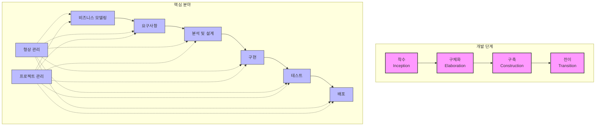

```mermaid
graph TB
    subgraph Phases[개발 단계]
        I[착수<br/>Inception]
        E[구체화<br/>Elaboration]
        C[구축<br/>Construction]
        T[전이<br/>Transition]
    end

    subgraph Disciplines[핵심 분야]
        BM[비즈니스 모델링]
        REQ[요구사항]
        AD[분석 및 설계]
        IMP[구현]
        TEST[테스트]
        DEP[배포]
        CM[형상 관리]
        PM[프로젝트 관리]
    end

    I --> E
    E --> C
    C --> T

    BM --> REQ
    REQ --> AD
    AD --> IMP
    IMP --> TEST
    TEST --> DEP

    CM -.-> BM
    CM -.-> REQ
    CM -.-> AD
    CM -.-> IMP
    CM -.-> TEST
    CM -.-> DEP

    PM -.-> BM
    PM -.-> REQ
    PM -.-> AD
    PM -.-> IMP
    PM -.-> TEST
    PM -.-> DEP

    classDef phase fill:#f9f,stroke:#333,stroke-width:2px
    classDef discipline fill:#bbf,stroke:#333,stroke-width:1px
    class I,E,C,T phase
    class BM,REQ,AD,IMP,TEST,DEP,CM,PM discipline
```