# Mermaid 다이어그램 가이드

Mermaid는 텍스트를 사용하여 다이어그램을 생성할 수 있는 도구입니다. 마크다운에서 쉽게 사용할 수 있으며, 다양한 종류의 다이어그램을 지원합니다.

## 목차
- [기본 문법](#기본-문법)
- [순서도 (Flowchart)](#순서도-flowchart)
- [시퀀스 다이어그램 (Sequence Diagram)](#시퀀스-다이어그램-sequence-diagram)
  - [기본 시퀀스](#기본-시퀀스)
  - [비동기 통신](#비동기-통신)
  - [콜백과 재귀](#콜백과-재귀)
  - [이벤트 기반 통신](#이벤트-기반-통신)
  - [타임아웃과 에러 처리](#타임아웃과-에러-처리)
  - [동기식 vs 비동기식](#동기식-vs-비동기식)
  - [루프와 옵션 처리](#루프와-옵션-처리)
- [클래스 다이어그램 (Class Diagram)](#클래스-다이어그램-class-diagram)
- [상태 다이어그램 (State Diagram)](#상태-다이어그램-state-diagram)
- [간트 차트 (Gantt Chart)](#간트-차트-gantt-chart)
- [ER 다이어그램 (Entity Relationship Diagram)](#er-다이어그램-entity-relationship-diagram)
- [시스템 아키텍처 다이어그램](#시스템-아키텍처-다이어그램)
  - [클라우드 시스템 구성도](#클라우드-시스템-구성도)
  - [마이크로서비스 아키텍처](#마이크로서비스-아키텍처)
  - [컨테이너 오케스트레이션](#컨테이너-오케스트레이션)
  - [CI/CD 파이프라인](#cicd-파이프라인)
    - [기본 파이프라인](#기본-파이프라인)
    - [Blue-Green 배포](#blue-green-배포)
    - [Canary 배포](#canary-배포)
    - [Rolling 배포](#rolling-배포)
- [팁과 트릭](#팁과-트릭)
- [유용한 참고 자료](#유용한-참고-자료)

## 기본 문법

Mermaid 다이어그램은 다음과 같이 작성합니다:

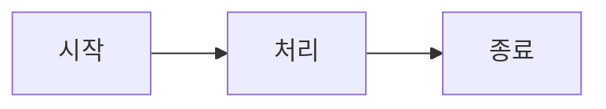
```mermaid
flowchart LR
    A[시작] --> B[처리]
    B --> C[종료]
```

## 순서도 (Flowchart)

기본적인 순서도 작성 예시:

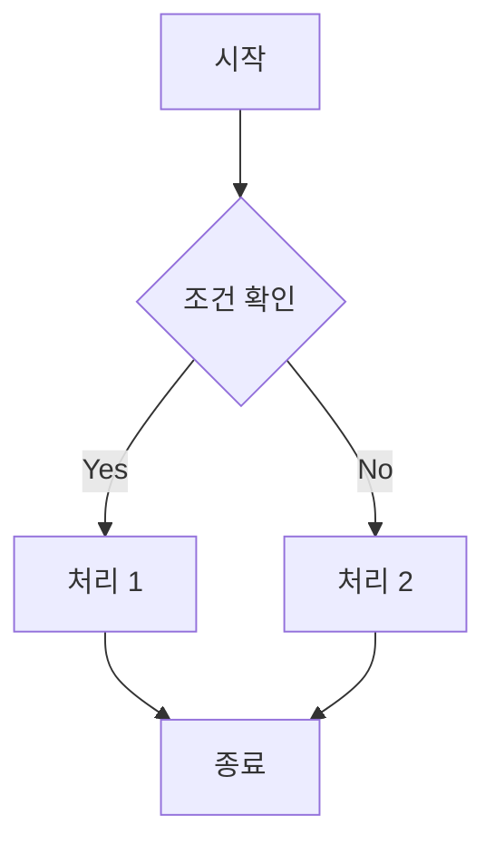
```mermaid
flowchart TD
    A[시작] --> B{조건 확인}
    B -->|Yes| C[처리 1]
    B -->|No| D[처리 2]
    C --> E[종료]
    D --> E
```

### 순서도 스타일 예시:

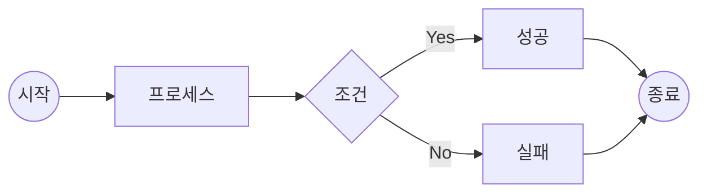
```mermaid
flowchart LR
    A((시작)) --> B[프로세스]
    B --> C{조건}
    C -->|Yes| D[성공]
    C -->|No| E[실패]
    D --> F((종료))
    E --> F
```

## 시퀀스 다이어그램 (Sequence Diagram)

### 기본 시퀀스

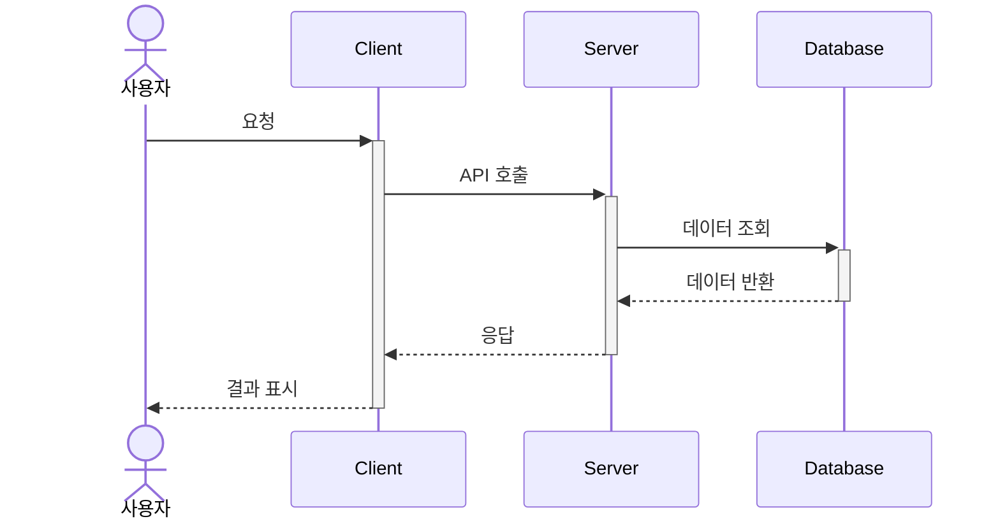
```mermaid
sequenceDiagram
    actor User as 사용자
    participant C as Client
    participant S as Server
    participant DB as Database

    User->>+C: 요청
    C->>+S: API 호출
    S->>+DB: 데이터 조회
    DB-->>-S: 데이터 반환
    S-->>-C: 응답
    C-->>-User: 결과 표시
```

### 비동기 통신

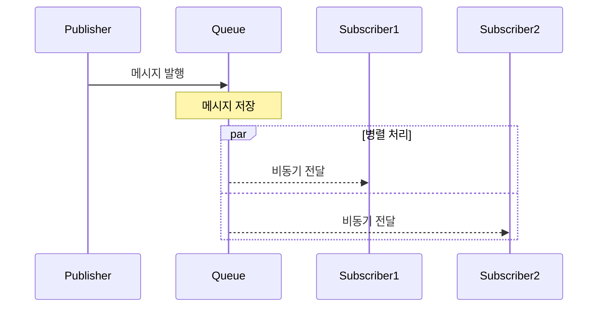
```mermaid
sequenceDiagram
    participant P as Publisher
    participant Q as Queue
    participant S1 as Subscriber1
    participant S2 as Subscriber2

    P->>Q: 메시지 발행
    Note over Q: 메시지 저장
    par 병렬 처리
        Q-->>S1: 비동기 전달
    and
        Q-->>S2: 비동기 전달
    end
```

### 콜백과 재귀

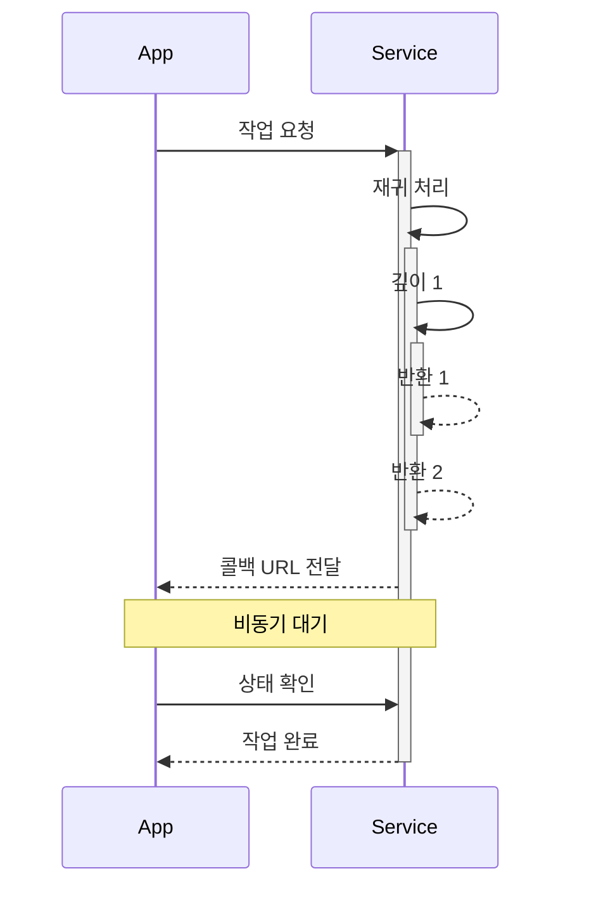
```mermaid
sequenceDiagram
    participant App
    participant Service

    App->>+Service: 작업 요청
    Service->>+Service: 재귀 처리
    Service->>+Service: 깊이 1
    Service-->>-Service: 반환 1
    Service-->>-Service: 반환 2

    Service-->>App: 콜백 URL 전달
    Note over App,Service: 비동기 대기

    App->>Service: 상태 확인
    Service-->>-App: 작업 완료
```

### 이벤트 기반 통신

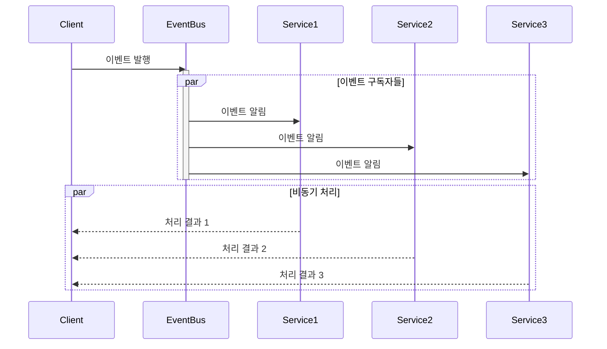
```mermaid
sequenceDiagram
    participant C as Client
    participant B as EventBus
    participant S1 as Service1
    participant S2 as Service2
    participant S3 as Service3

    C->>B: 이벤트 발행
    activate B
    par 이벤트 구독자들
        B->>S1: 이벤트 알림
        B->>S2: 이벤트 알림
        B->>S3: 이벤트 알림
    end
    deactivate B

    par 비동기 처리
        S1-->>C: 처리 결과 1
        S2-->>C: 처리 결과 2
        S3-->>C: 처리 결과 3
    end
```

### 타임아웃과 에러 처리

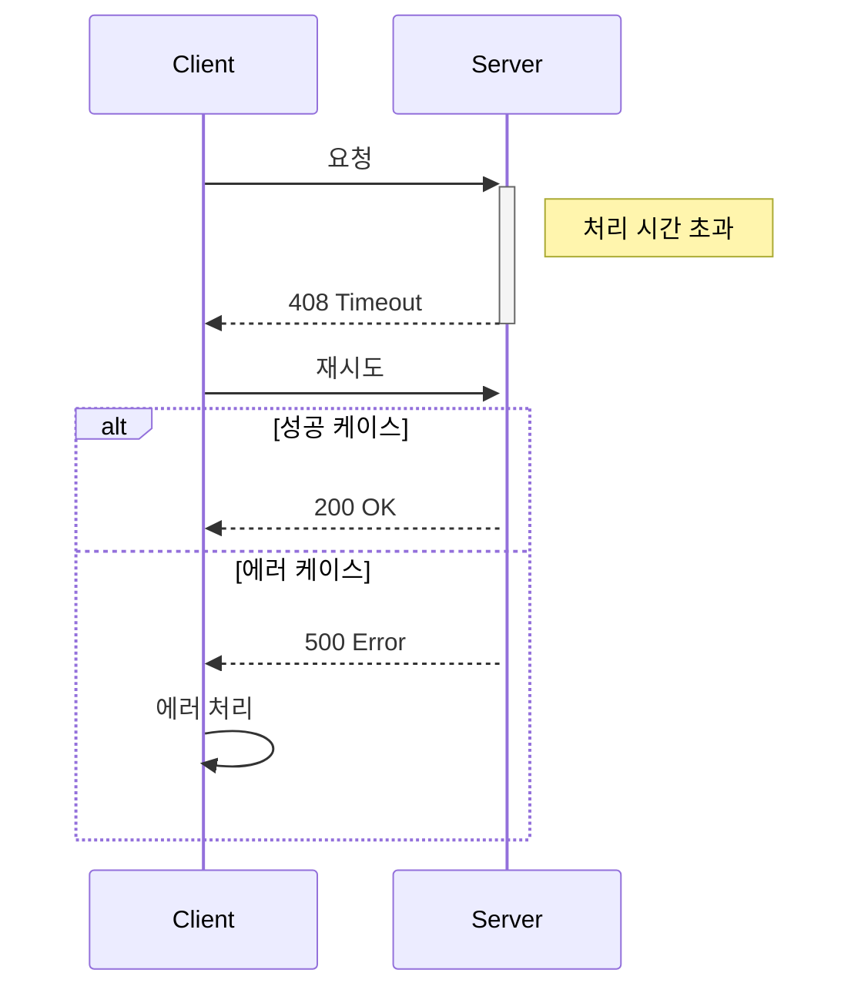
```mermaid
sequenceDiagram
    participant C as Client
    participant S as Server

    C->>+S: 요청
    Note right of S: 처리 시간 초과
    S-->>-C: 408 Timeout

    C->>+S: 재시도
    alt 성공 케이스
        S-->>C: 200 OK
    else 에러 케이스
        S-->>C: 500 Error
        C->>C: 에러 처리
    end
```

### 동기식 vs 비동기식

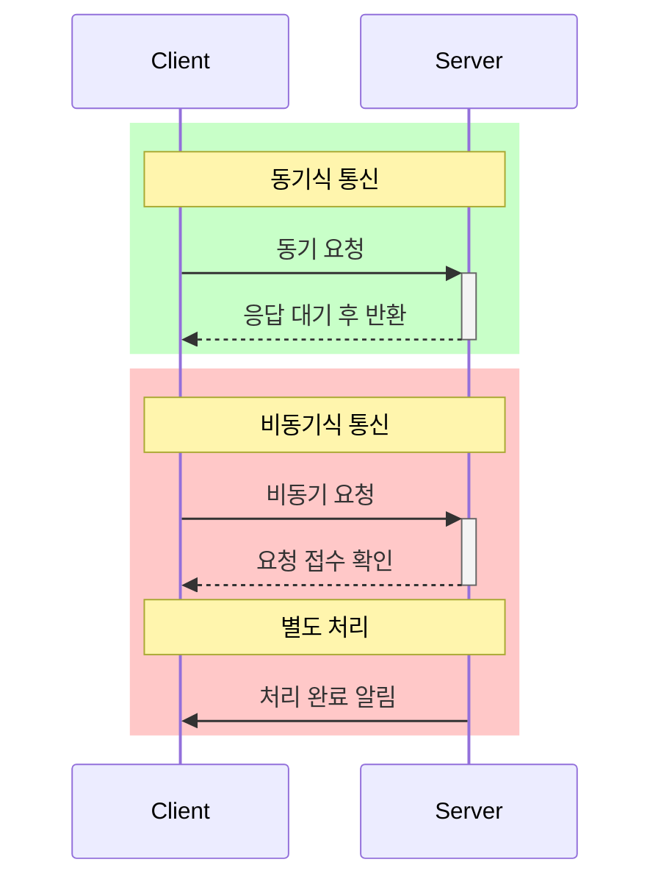
```mermaid
sequenceDiagram
    participant C as Client
    participant S as Server

    rect rgb(200, 255, 200)
        Note over C,S: 동기식 통신
        C->>+S: 동기 요청
        S-->>-C: 응답 대기 후 반환
    end

    rect rgb(255, 200, 200)
        Note over C,S: 비동기식 통신
        C->>+S: 비동기 요청
        S-->>-C: 요청 접수 확인

        Note over C,S: 별도 처리
        S->>C: 처리 완료 알림
    end
```

### 루프와 옵션 처리

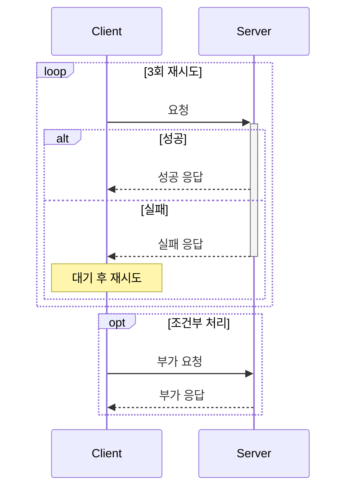
```mermaid
sequenceDiagram
    participant C as Client
    participant S as Server

    loop 3회 재시도
        C->>+S: 요청
        alt 성공
            S-->>C: 성공 응답
        else 실패
            S-->>-C: 실패 응답
            Note over C: 대기 후 재시도
        end
    end

    opt 조건부 처리
        C->>S: 부가 요청
        S-->>C: 부가 응답
    end
```

## 클래스 다이어그램 (Class Diagram)

객체지향 설계를 표현하는 예시:

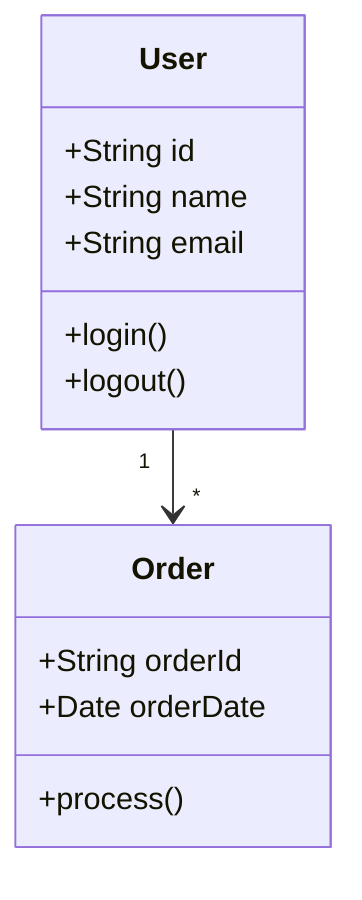
```mermaid
classDiagram
    class User {
        +String id
        +String name
        +String email
        +login()
        +logout()
    }
    class Order {
        +String orderId
        +Date orderDate
        +process()
    }
    User "1" --> "*" Order
```

## 상태 다이어그램 (State Diagram)

시스템의 상태 변화를 표현하는 예시:

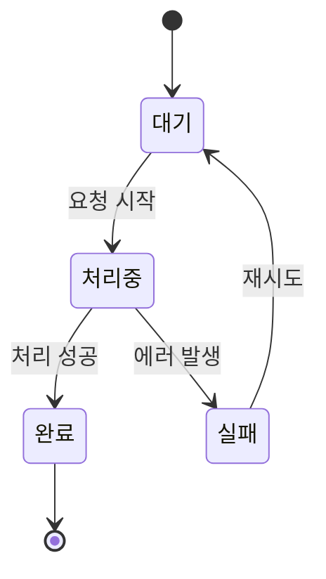
```mermaid
stateDiagram-v2
    [*] --> 대기
    대기 --> 처리중: 요청 시작
    처리중 --> 완료: 처리 성공
    처리중 --> 실패: 에러 발생
    완료 --> [*]
    실패 --> 대기: 재시도
```

## 간트 차트 (Gantt Chart)

프로젝트 일정을 표현하는 예시:

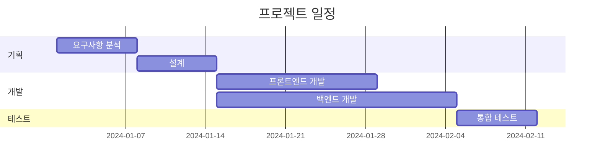
```mermaid
gantt
    title 프로젝트 일정
    dateFormat YYYY-MM-DD
    section 기획
    요구사항 분석    :a1, 2024-01-01, 7d
    설계            :a2, after a1, 7d
    section 개발
    프론트엔드 개발   :a3, after a2, 14d
    백엔드 개발      :a4, after a2, 21d
    section 테스트
    통합 테스트      :after a4, 7d
```

## ER 다이어그램 (Entity Relationship Diagram)

데이터베이스 구조를 표현하는 예시:

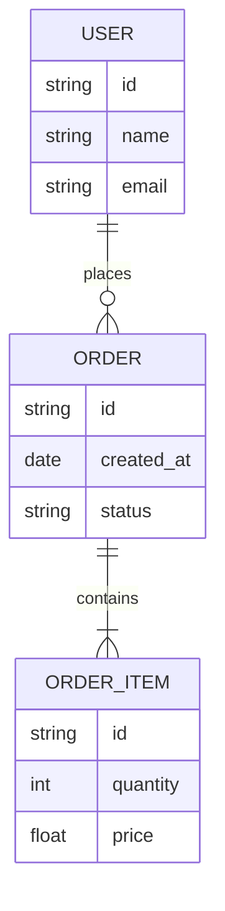
```mermaid
erDiagram
    USER ||--o{ ORDER : places
    USER {
        string id
        string name
        string email
    }
    ORDER ||--|{ ORDER_ITEM : contains
    ORDER {
        string id
        date created_at
        string status
    }
    ORDER_ITEM {
        string id
        int quantity
        float price
    }
```

## 시스템 아키텍처 다이어그램

### 클라우드 시스템 구성도

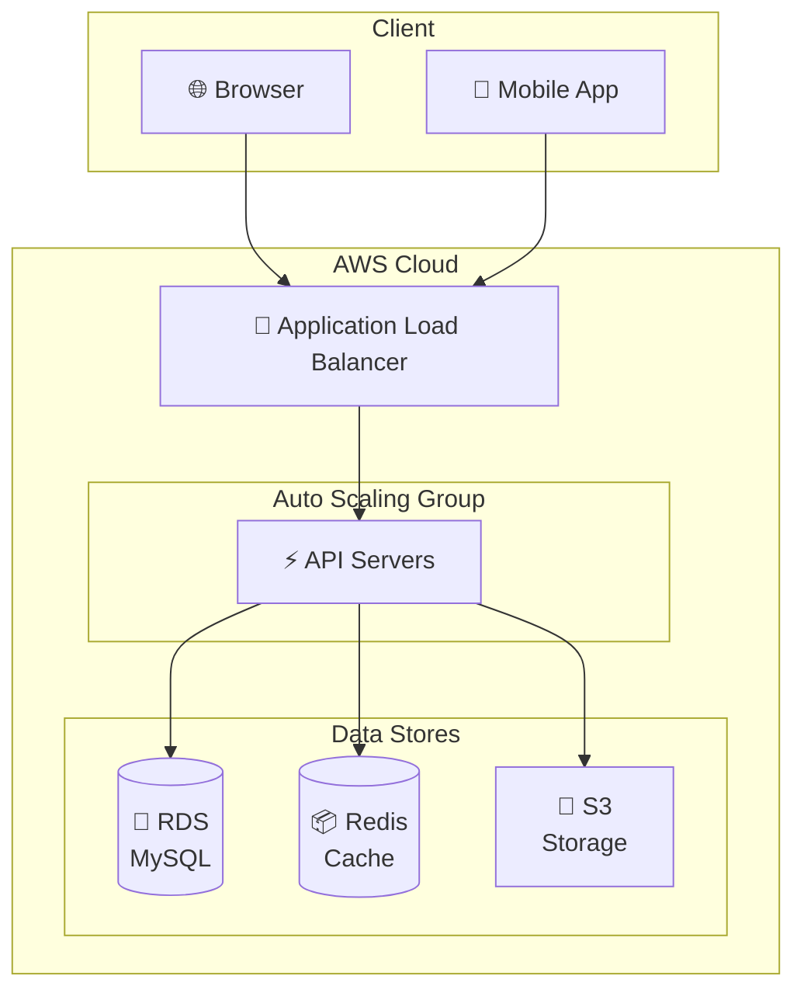
```mermaid
flowchart TB
    subgraph Client
        Browser["🌐 Browser"]
        Mobile["📱 Mobile App"]
    end

    subgraph AWS Cloud
        direction TB
        ALB["🔄 Application Load Balancer"]

        subgraph "Auto Scaling Group"
            API["⚡ API Servers"]
        end

        subgraph "Data Stores"
            direction LR
            RDS[("💾 RDS\nMySQL")]
            Redis[("📦 Redis\nCache")]
            S3["📂 S3\nStorage"]
        end
    end

    Browser --> ALB
    Mobile --> ALB
    ALB --> API
    API --> RDS
    API --> Redis
    API --> S3
```

### 마이크로서비스 아키텍처

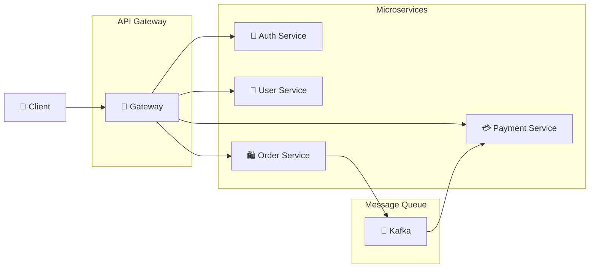
```mermaid
flowchart LR
    Client["👤 Client"]

    subgraph "API Gateway"
        Gateway["🚪 Gateway"]
    end

    subgraph "Microservices"
        Auth["🔐 Auth Service"]
        User["👥 User Service"]
        Order["🛍️ Order Service"]
        Payment["💳 Payment Service"]
    end

    subgraph "Message Queue"
        Kafka["📨 Kafka"]
    end

    Client --> Gateway
    Gateway --> Auth
    Gateway --> User
    Gateway --> Order
    Gateway --> Payment

    Order --> Kafka
    Kafka --> Payment
```

### 컨테이너 오케스트레이션

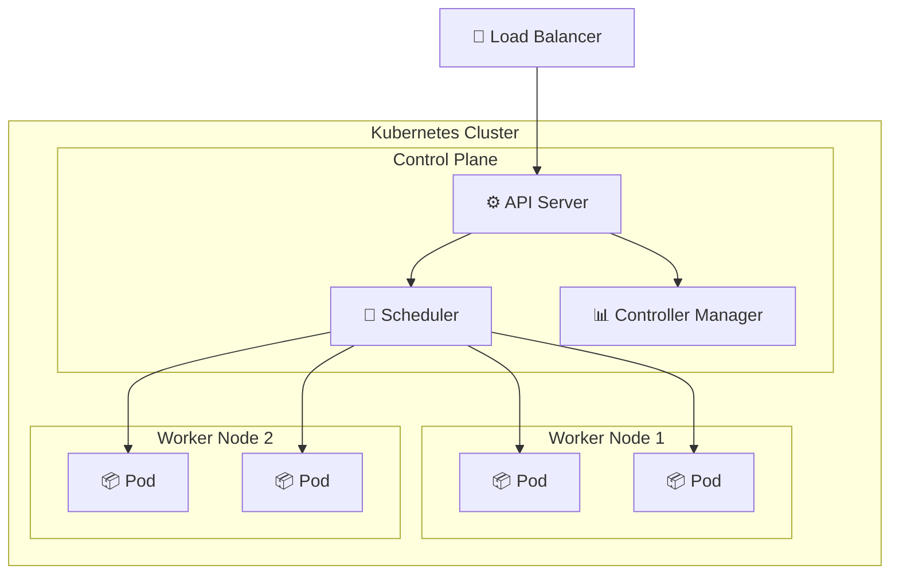
```mermaid
flowchart TB
    subgraph "Kubernetes Cluster"
        direction TB

        subgraph "Control Plane"
            API["⚙️ API Server"]
            Scheduler["📅 Scheduler"]
            CM["📊 Controller Manager"]
        end

        subgraph "Worker Node 1"
            Pod1["📦 Pod"]
            Pod2["📦 Pod"]
        end

        subgraph "Worker Node 2"
            Pod3["📦 Pod"]
            Pod4["📦 Pod"]
        end
    end

    LoadBalancer["🔄 Load Balancer"] --> API
    API --> Scheduler
    API --> CM
    Scheduler --> Pod1
    Scheduler --> Pod2
    Scheduler --> Pod3
    Scheduler --> Pod4
```

### CI/CD 파이프라인

### 기본 파이프라인

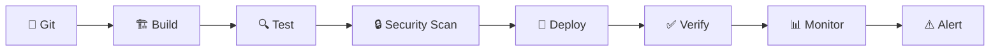
```mermaid
flowchart LR
    Git["📝 Git"] --> Build["🏗️ Build"]
    Build --> Test["🔍 Test"]
    Test --> Scan["🔒 Security Scan"]
    Scan --> Deploy["🚀 Deploy"]
    Deploy --> Verify["✅ Verify"]
    Verify --> Monitor["📊 Monitor"]
    Monitor --> Alert["⚠️ Alert"]
```

### Blue-Green 배포

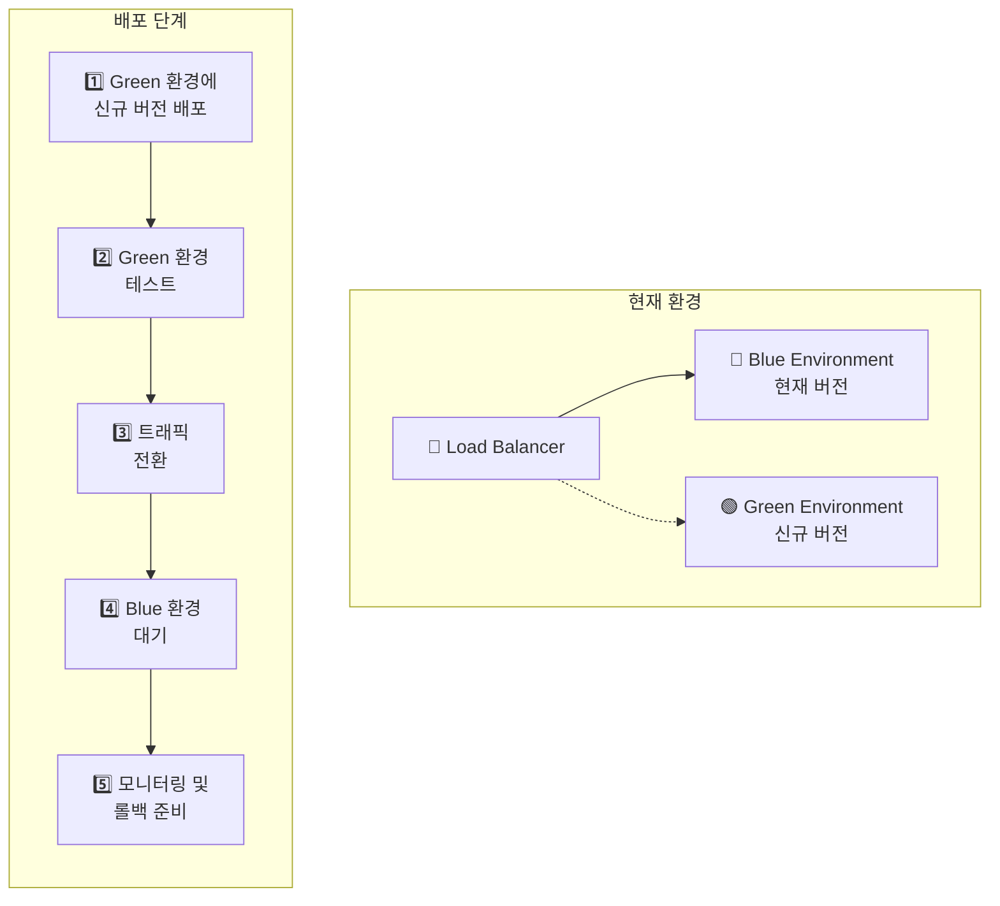
```mermaid
flowchart TB
    subgraph Current["현재 환경"]
        LB["🔄 Load Balancer"]
        Blue["🔵 Blue Environment<br/>현재 버전"]
        Green["🟢 Green Environment<br/>신규 버전"]
    end

    subgraph Steps["배포 단계"]
        direction TB
        Step1["1️⃣ Green 환경에<br/>신규 버전 배포"]
        Step2["2️⃣ Green 환경<br/>테스트"]
        Step3["3️⃣ 트래픽<br/>전환"]
        Step4["4️⃣ Blue 환경<br/>대기"]
        Step5["5️⃣ 모니터링 및<br/>롤백 준비"]
    end

    LB --> Blue
    LB -.-> Green
    Step1 --> Step2 --> Step3 --> Step4 --> Step5
```

### Canary 배포

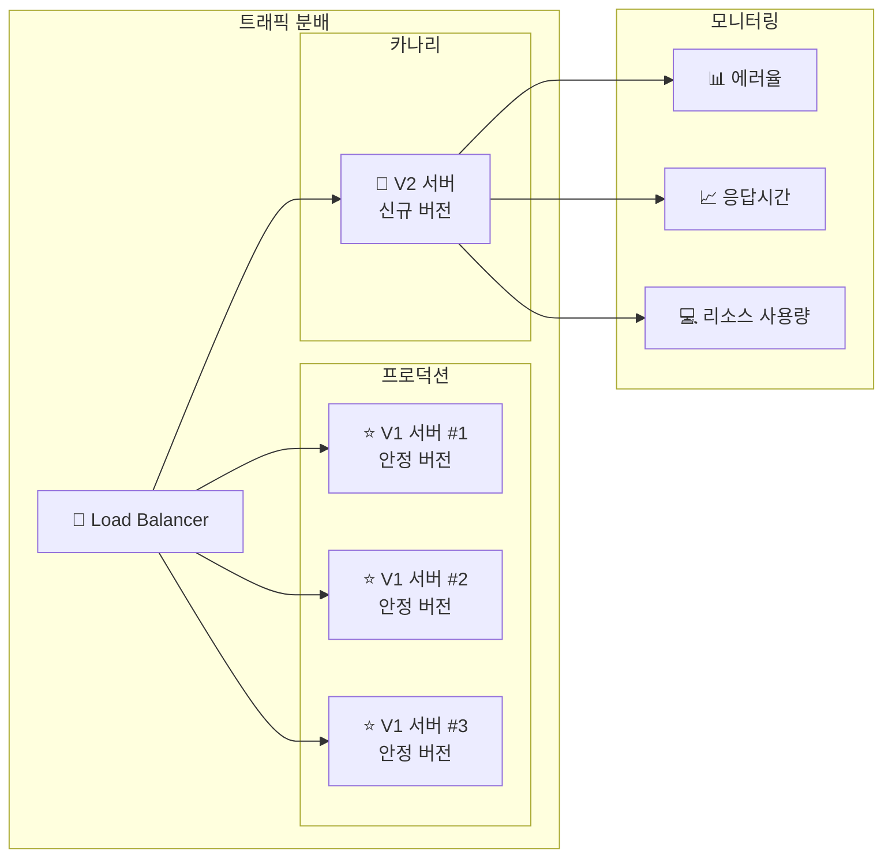
```mermaid
flowchart LR
    subgraph Traffic["트래픽 분배"]
        LB["🔄 Load Balancer"]
        subgraph Prod["프로덕션"]
            P1["⭐ V1 서버 #1<br/>안정 버전"]
            P2["⭐ V1 서버 #2<br/>안정 버전"]
            P3["⭐ V1 서버 #3<br/>안정 버전"]
        end
        subgraph Canary["카나리"]
            C1["🔆 V2 서버<br/>신규 버전"]
        end
    end

    subgraph Monitoring["모니터링"]
        M1["📊 에러율"]
        M2["📈 응답시간"]
        M3["💻 리소스 사용량"]
    end

    LB --> P1
    LB --> P2
    LB --> P3
    LB --> C1

    C1 --> M1
    C1 --> M2
    C1 --> M3
```

### Rolling 배포

```mermaid
flowchart TB
    subgraph Cluster["쿠버네티스 클러스터"]
        LB["🔄 Load Balancer"]
        subgraph Pods["파드"]
            direction LR
            subgraph Old["기존 버전"]
                P1["📦 V1"]
                P2["📦 V1"]
                P3["📦 V1"]
            end
            subgraph New["신규 버전"]
                P4["📦 V2"]
                P5["📦 V2"]
                P6["📦 V2"]
            end
        end
    end

    LB --> P1 & P2 & P3
    LB --> P4 & P5 & P6

    subgraph Process["배포 프로세스"]
        direction TB
        S1["1️⃣ 초기 상태<br/>모든 파드 V1"]
        S2["2️⃣ 1/3 파드<br/>V2로 교체"]
        S3["3️⃣ 2/3 파드<br/>V2로 교체"]
        S4["4️⃣ 전체 파드<br/>V2로 교체"]
    end

    S1 --> S2 --> S3 --> S4
```

### A/B 테스트

```mermaid
flowchart TB
    subgraph Test["A/B 테스트 환경"]
        LB["🔄 Load Balancer"]
        subgraph Variants["테스트 변형"]
            A["🅰️ A 버전<br/>기존 기능"]
            B["🅱️ B 버전<br/>신규 기능"]
        end
    end

    subgraph Metrics["분석 지표"]
        M1["📊 전환율"]
        M2["⏱️ 체류시간"]
        M3["💰 매출"]
    end

    LB --> A
    LB --> B
    A --> M1 & M2 & M3
    B --> M1 & M2 & M3
```

## 팁과 트릭

1. 방향 지정
   - TB (top to bottom)
   - BT (bottom to top)
   - RL (right to left)
   - LR (left to right)

2. 노드 모양
   - `[]` 사각형
   - `()` 원형
   - `{}` 마름모
   - `[[]]` 서브루틴
   - `[()]` 스타디움

3. 선 스타일
   - `-->` 화살표
   - `---` 실선
   - `-.-` 점선
   - `===` 굵은 선

4. 색상 적용
   - style 구문을 사용하여 노드와 선의 색상 변경 가능
   - fill: 배경색
   - stroke: 선 색상
   - color: 텍스트 색상

## 유용한 참고 자료

### 공식 문서 및 도구
- [Mermaid 공식 문서](https://mermaid.js.org/intro/)
- [Mermaid Live Editor](https://mermaid.live/)
- [Mermaid CLI](https://github.com/mermaid-js/mermaid-cli)

### 학습 자료
- [Mermaid.js 튜토리얼](https://mermaid.js.org/syntax/flowchart.html)
- [GitHub의 Mermaid 지원](https://github.blog/2022-02-14-include-diagrams-markdown-files-mermaid/)
- [VS Code Mermaid 확장](https://marketplace.visualstudio.com/items?itemName=bierner.markdown-mermaid)

### 아이콘 및 다이어그램 예시
- [클라우드 아키텍처 아이콘](https://aws.amazon.com/architecture/icons/)
- [Azure 아키텍처 아이콘](https://learn.microsoft.com/en-us/azure/architecture/icons/)
- [구글 클라우드 아이콘](https://cloud.google.com/icons)

### 추천 도구
- [Draw.io](https://draw.io/) - 전문적인 다이어그램 작성 도구
- [Excalidraw](https://excalidraw.com/) - 손으로 그린 듯한 다이어그램 작성
- [PlantUML](https://plantuml.com/) - UML 다이어그램 전문 도구

### 모범 사례
- 다이어그램은 간단하고 명확하게 유지
- 중요한 컴포넌트만 포함하고 불필요한 세부사항은 제외
- 일관된 아이콘과 명명 규칙 사용
- 방향성과 데이터 흐름을 명확하게 표시
- 적절한 주석과 레이블 추가