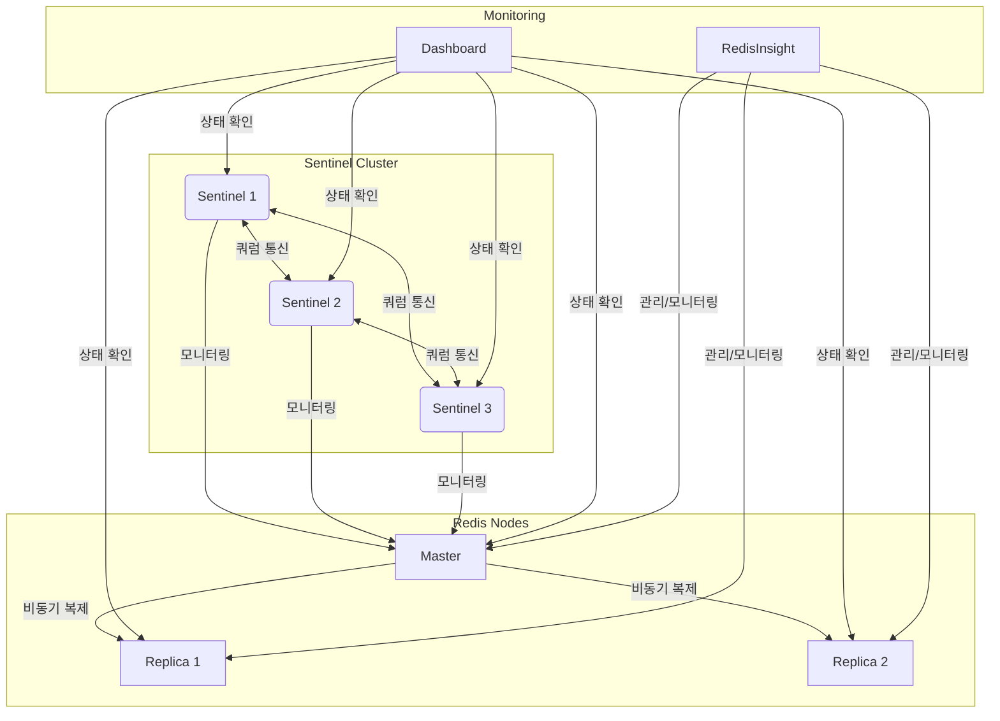

# Redis Sentinel HA 구성

이 프로젝트는 Redis Sentinel을 사용한 고가용성(HA) 구성을 Docker Compose로 구현하고, 웹 기반 모니터링 시스템을 제공합니다.

## 시스템 구성

- Redis 마스터 노드 1개
- Redis 복제본(replica) 노드 2개
- Redis Sentinel 노드 3개
- 웹 기반 모니터링 대시보드
- RedisInsight 모니터링 도구

## 시스템 구성도



## 시스템 요구사항

- Docker 및 Docker Compose
- 웹 브라우저

## 설치 및 실행 방법

1. 저장소 클론

```bash
git clone <repository-url>
cd redis-ha
```

2. Docker Compose로 시스템 시작

```bash
docker-compose -f redis-sentinel.yml up -d
```

3. RedisInsight 설정 (자동 구성이 실패하는 경우 수동 설정)

```bash
# RedisInsight 구성 스크립트 실행 (자동 구성 시도)
./redisinsight-config/startup.sh
```

4. 모니터링 서비스 접속

- 커스텀 모니터링 대시보드: `http://localhost:5001`
- RedisInsight: `http://localhost:8003`

## 기능

### 모니터링 대시보드

- Redis 노드 및 Sentinel 상태 실시간 모니터링
- 마스터-복제본 관계 시각화 (Mermaid 다이어그램)
- 노드별 상세 정보 표시
- 자동 상태 갱신 (5초 간격)

### RedisInsight 활용하기

RedisInsight는 Redis Labs에서 제공하는 공식 GUI 도구로, Redis 인스턴스의 모니터링과 관리를 위한 강력한 기능을 제공합니다.

#### RedisInsight 자동 구성 시도

프로젝트에 포함된 구성 스크립트를 통해 RedisInsight에 Redis 노드를 자동으로 등록하려고 시도합니다:

```bash
# RedisInsight 구성 스크립트 실행
./redisinsight-config/startup.sh
```

자동 구성이 실패하는 경우(환경이나 버전에 따라 다를 수 있음) 아래의 수동 설정 방법을 따라주세요.

#### RedisInsight 수동 설정 방법

1. 웹 브라우저에서 `http://localhost:8003` 접속
2. "I already have a Redis database" 선택
3. 아래 정보를 사용하여 각 데이터베이스를 순차적으로 추가:

##### 마스터 노드 추가
- **Host**: host.docker.internal
- **Port**: 6379
- **Name**: Redis Master
- **Username**: (비워두기)
- **Password**: (비워두기)
- Test Connection 클릭 후 연결 확인
- Add Redis Database 클릭하여 완료

##### 복제본 노드 1 추가
- **Host**: host.docker.internal
- **Port**: 6380
- **Name**: Redis Replica 1
- **Username**: (비워두기)
- **Password**: (비워두기)
- Test Connection 클릭 후 연결 확인
- Add Redis Database 클릭하여 완료

##### 복제본 노드 2 추가
- **Host**: host.docker.internal
- **Port**: 6381
- **Name**: Redis Replica 2
- **Username**: (비워두기)
- **Password**: (비워두기)
- Test Connection 클릭 후 연결 확인
- Add Redis Database 클릭하여 완료

##### Sentinel 클러스터 추가
- **Connection Type**: Sentinel (고급 설정에서 선택)
- **Master Group Name**: mymaster
- **Sentinels**:
  - Host: host.docker.internal, Port: 26379
  - Host: host.docker.internal, Port: 26380
  - Host: host.docker.internal, Port: 26381
- **Name**: Redis Sentinel Cluster
- **Username**: (비워두기)
- **Password**: (비워두기)
- Test Connection 클릭 후 연결 확인
- Add Redis Database 클릭하여 완료

#### MacOS와 Windows 사용자를 위한 참고사항
> Docker 컨테이너에서 호스트 머신에 접근하기 위해 `host.docker.internal`을 사용합니다. 이는 컨테이너 내부에서 호스트 머신의 IP 주소를 참조하는 특별한 DNS 이름입니다. Linux 사용자는 Docker 버전에 따라 추가 설정이 필요할 수 있습니다.

#### RedisInsight 활용

- **Browser**: Redis 데이터 탐색 및 편집
- **Slowlog**: 느린 쿼리 분석
- **CLI**: Redis 명령 실행
- **Info**: 실시간 서버 성능 메트릭
- **Analytics**: 성능 분석
- **Profiler**: 명령어 프로파일링

### Failover 테스트

대시보드 상단에 있는 "Failover 테스트" 버튼을 클릭하여 수동으로 장애 조치를 시작할 수 있습니다. 이 기능은 Sentinel이 마스터 노드를 변경하도록 유도합니다.

## 장애 시나리오 테스트 방법

### 1. 마스터 노드 다운 시나리오

```bash
# 마스터 노드 중지
docker stop redis-master
```

Sentinel은 마스터 노드 다운을 감지하고 복제본 중 하나를 새로운 마스터로 승격시킵니다.

### 2. 네트워크 분리 시나리오

```bash
# 마스터 노드 네트워크 분리
docker network disconnect redis-ha_redis-net redis-master
```

### 3. 마스터 복구 시나리오

```bash
# 마스터 노드 재시작
docker start redis-master
```

이전 마스터 노드는 복제본으로 재구성됩니다.

## 모니터링 및 관리 명령어

### Redis CLI 접속

```bash
# 마스터 노드 접속
docker exec -it redis-master redis-cli

# 복제본 노드 접속
docker exec -it redis-replica1 redis-cli
docker exec -it redis-replica2 redis-cli
```

### Sentinel 정보 확인

```bash
# Sentinel 노드 접속
docker exec -it sentinel1 redis-cli -p 26379

# 마스터 정보 확인
sentinel master mymaster

# 복제본 목록 확인
sentinel replicas mymaster

# Sentinel 목록 확인
sentinel sentinels mymaster
```

## RedisInsight vs 커스텀 모니터링 대시보드 비교

| 기능 | RedisInsight | 커스텀 대시보드 |
|-----|-------------|----------------|
| 실시간 모니터링 | ✅ | ✅ |
| 데이터 탐색/편집 | ✅ | ❌ |
| Mermaid 시각화 | ❌ | ✅ |
| 성능 분석 | ✅ | ❌ |
| Redis 명령 실행 | ✅ | ❌ |
| Sentinel 관리 | ✅ | ✅ |
| Failover 테스트 | ✅ | ✅ |
| 사용자 정의 UI | ❌ | ✅ |

## 주요 구성 파일

- `redis-sentinel.yml`: Docker Compose 구성 파일
- `redis-master.conf`: 마스터 노드 설정
- `redis-replica1.conf`, `redis-replica2.conf`: 복제본 노드 설정
- `sentinel1.conf`, `sentinel2.conf`, `sentinel3.conf`: Sentinel 설정
- `app.py`: 모니터링 애플리케이션
- `redisinsight-config/`: RedisInsight 자동 구성 파일

## 시스템 종료

```bash
docker-compose -f redis-sentinel.yml down
```