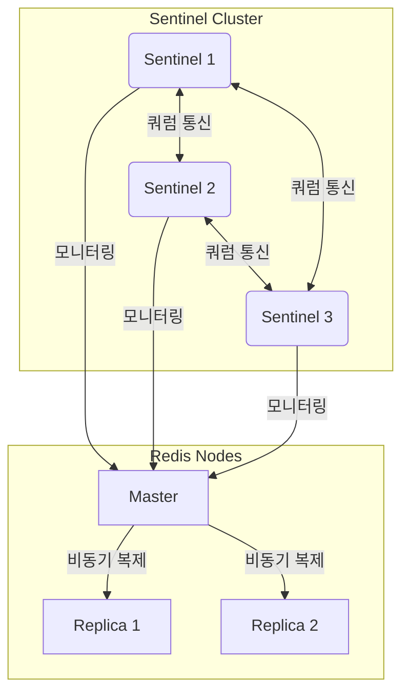

# Redis Sentinel HA 구성

이 프로젝트는 Redis Sentinel을 사용한 고가용성(HA) 구성을 Docker Compose로 구현하고, 웹 기반 모니터링 시스템을 제공합니다.

## 시스템 구성

- Redis 마스터 노드 1개
- Redis 복제본(replica) 노드 2개
- Redis Sentinel 노드 3개
- 웹 기반 모니터링 대시보드

## 시스템 구성도



## 시스템 요구사항

- Docker 및 Docker Compose
- 웹 브라우저

## 설치 및 실행 방법

1. 저장소 클론

```bash
git clone <repository-url>
cd redis-ha
```

2. Docker Compose로 시스템 시작

```bash
docker-compose -f redis-sentinel.yml up -d
```

3. 모니터링 대시보드 접속

웹 브라우저에서 `http://localhost:5000`으로 접속합니다.

## 기능

### 모니터링 대시보드

- Redis 노드 및 Sentinel 상태 실시간 모니터링
- 마스터-복제본 관계 시각화 (Mermaid 다이어그램)
- 노드별 상세 정보 표시
- 자동 상태 갱신 (5초 간격)

### Failover 테스트

대시보드 상단에 있는 "Failover 테스트" 버튼을 클릭하여 수동으로 장애 조치를 시작할 수 있습니다. 이 기능은 Sentinel이 마스터 노드를 변경하도록 유도합니다.

## 장애 시나리오 테스트 방법

### 1. 마스터 노드 다운 시나리오

```bash
# 마스터 노드 중지
docker stop redis-master
```

Sentinel은 마스터 노드 다운을 감지하고 복제본 중 하나를 새로운 마스터로 승격시킵니다.

### 2. 네트워크 분리 시나리오

```bash
# 마스터 노드 네트워크 분리
docker network disconnect redis-ha_redis-net redis-master
```

### 3. 마스터 복구 시나리오

```bash
# 마스터 노드 재시작
docker start redis-master
```

이전 마스터 노드는 복제본으로 재구성됩니다.

## 모니터링 및 관리 명령어

### Redis CLI 접속

```bash
# 마스터 노드 접속
docker exec -it redis-master redis-cli

# 복제본 노드 접속
docker exec -it redis-replica1 redis-cli
docker exec -it redis-replica2 redis-cli
```

### Sentinel 정보 확인

```bash
# Sentinel 노드 접속
docker exec -it sentinel1 redis-cli -p 26379

# 마스터 정보 확인
sentinel master mymaster

# 복제본 목록 확인
sentinel replicas mymaster

# Sentinel 목록 확인
sentinel sentinels mymaster
```

## 주요 구성 파일

- `redis-sentinel.yml`: Docker Compose 구성 파일
- `redis-master.conf`: 마스터 노드 설정
- `redis-replica1.conf`, `redis-replica2.conf`: 복제본 노드 설정
- `sentinel1.conf`, `sentinel2.conf`, `sentinel3.conf`: Sentinel 설정
- `app.py`: 모니터링 애플리케이션

## 시스템 종료

```bash
docker-compose -f redis-sentinel.yml down
```