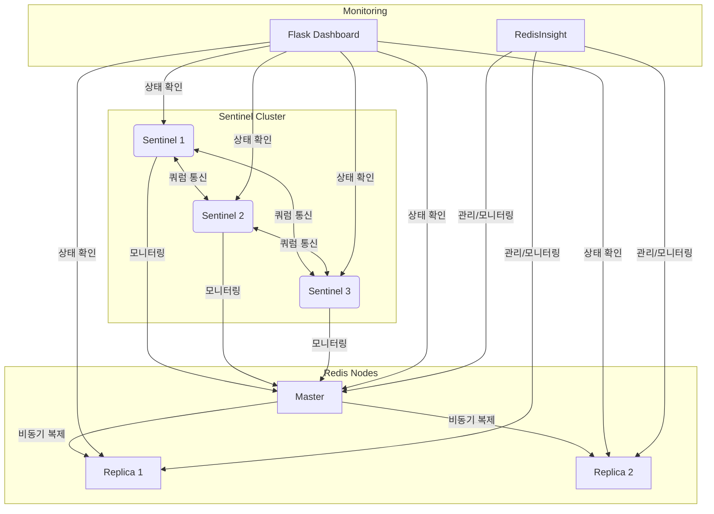

## Redis Sentinel HA 구성도 (Mermaid) + RedisInsight

## Redis Sentinel HA 구성도



## 구성 요소

1. **Redis 마스터/복제본**: 핵심 데이터 저장 노드
2. **Redis Sentinel**: 고가용성 관리 및 장애 감지
3. **Flask 대시보드**: 커스텀 모니터링 웹 UI
4. **RedisInsight**: 공식 Redis 관리 도구

## Redis Sentinel 테스트 환경 (Docker Compose)

시스템은 다음과 같은 Docker 컨테이너로 구성됩니다:

- redis-master: 마스터 노드 (포트 6379)
- redis-replica1: 복제본 노드 1 (포트 6380)
- redis-replica2: 복제본 노드 2 (포트 6381)
- sentinel1, sentinel2, sentinel3: Sentinel 노드 (포트 26379-26381)
- monitor: Flask 기반 모니터링 대시보드 (포트 5001)
- redisinsight: Redis 공식 GUI 관리 도구 (포트 8003)

## 구현된 모니터링 시스템 특징

### Flask 모니터링 대시보드 (포트 5001)

- Mermaid.js 기반 다이어그램 시각화
- 실시간 노드 상태 모니터링
- 수동 Failover 테스트 기능
- 자동 상태 새로고침

### RedisInsight 모니터링 (포트 8003)

- 공식 Redis 관리 도구
- 데이터 탐색 및 편집
- 성능 메트릭 분석
- 명령어 실행 인터페이스
- Slowlog 및 성능 분석

## 장애 조치 테스트 시나리오

1. **마스터 노드 다운 테스트**
   - `docker stop redis-master` 명령으로 마스터 중지
   - Sentinel이 자동으로 복제본 중 하나를 마스터로 승격

2. **네트워크 분리 테스트**
   - `docker network disconnect redis-ha_redis-net redis-master`
   - 네트워크 단절 상황에서의 장애 조치 테스트

3. **수동 Failover 테스트**
   - 웹 대시보드의 Failover 버튼 클릭
   - 또는 RedisInsight 인터페이스에서 Failover 명령 실행

4. **자동화된 테스트 스크립트**
   - `test-failover.sh` 스크립트 실행
   - 장애 발생, 감지, 복구까지 전체 과정 자동화

## RedisInsight vs 커스텀 모니터링 시스템 비교

| 기능 | RedisInsight | 커스텀 대시보드 |
|-----|-------------|----------------|
| 실시간 모니터링 | ✅ | ✅ |
| 데이터 탐색/편집 | ✅ | ❌ |
| Mermaid 시각화 | ❌ | ✅ |
| 성능 분석 | ✅ | ❌ |
| Redis 명령 실행 | ✅ | ❌ |
| Sentinel 관리 | ✅ | ✅ |
| Failover 테스트 | ✅ | ✅ |
| 사용자 정의 UI | ❌ | ✅ |

## 실행 방법

```bash
# 시스템 시작
docker-compose -f redis-sentinel.yml up -d

# 장애 조치 자동 테스트
./test-failover.sh

# 시스템 종료
docker-compose -f redis-sentinel.yml down
```

## 결론 및 활용 방안

Redis Sentinel HA 구성은 프로덕션 환경에서 Redis의 고가용성을 보장하는 핵심 아키텍처입니다. 이 테스트 환경은 다음과 같은 목적으로 활용할 수 있습니다:

1. Redis Sentinel 작동 원리 학습
2. 장애 조치 시나리오 테스트 및 검증
3. 모니터링 시스템 구축 연습
4. 애플리케이션의 Redis 장애 대응 로직 테스트

RedisInsight와 커스텀 모니터링 대시보드를 함께 활용하면 보다 완벽한 Redis HA 운영 환경을 구축할 수 있습니다.


# 혹시 관련해서 오픈소스 관리툴이 있을까?

Redis 운영 및 모니터링을 위한 주요 오픈소스 관리 도구들이 다양하게 존재합니다. 각 도구의 특징과 활용 방법을 살펴보겠습니다.

## 1. **RedisInsight**

- **공식 GUI 도구**로 Redis Labs에서 제공
- **실시간 메트릭 모니터링** (CPU, 메모리, 연결 수 등)
- 클러스터 관리 기능 (슬롯 재분배, 노드 승격)
- 데이터 탐색 및 편집 (Key/Value 검색, 수정, 삭제)
- CLI 통합 터미널 제공[^1][^11]

```bash
# 도커로 설치
docker run -d --name redisinsight -p 8001:8001 redislabs/redisinsight:latest
```


## 2. **AnotherRedisDesktopManager (ARDM)**

- 크로스 플랫폼 지원 오픈소스 GUI
- 다중 연결 관리 (동시에 여러 Redis 인스턴스 접속)
- 데이터 시각화 (트리 구조로 Key 계층 표현)
- TTL 설정 및 백업/복원 기능[^3][^15]


## 3. **Redis-Stat**

- **터미널 기반 모니터링 도구**
- 실시간 성능 지표 시각화 (CPU, 메모리, 명령어 통계)
- 2초 간격 자동 갱신
- 도커로 손촬게 설치 가능[^7][^16]

```bash
docker run -p 63790:63790 -d insready/redis-stat --server redis-host:6379
```


## 4. **Prometheus + Grafana 연동**

- **고급 모니터링 시스템 구축**
- Redis Exporter를 통해 메트릭 수집
- 사용자 정의 대시보드 생성
- 경고 알림 설정 가능[^9][^10]

```yaml
# Prometheus 설정 예시
scrape_configs:
  - job_name: 'redis'
    static_configs:
      - targets: ['redis-exporter:9121']
```


## 5. **REMON (Redis Monitoring)**

- 웹 기반 모니터링 솔루션
- 클러스터 상태 요약 정보 제공
- 노드별 상세 메트릭 분석
- 이벤트 로그 추적 기능[^6][^17]


## 기능 비교 표

| 도구 | GUI 지원 | 실시간 모니터링 | 클러스터 관리 | 경고 기능 |
| :-- | :-- | :-- | :-- | :-- |
| RedisInsight | ✔️ | ✔️ | ✔️ | ❌ |
| ARDM | ✔️ | ❌ | ❌ | ❌ |
| Redis-Stat | ❌ | ✔️ | ❌ | ❌ |
| Prometheus+Grafana | ❌ | ✔️ | ✔️ | ✔️ |
| REMON | ✔️ | ✔️ | ✔️ | ✔️ |

개발 환경에서는 RedisInsight나 ARDM을, 프로덕션 시스템에는 Prometheus+Grafana 조합을 권장합니다. 특히 RedisInsight는 공식 도구로서 안정성이 검증되어 있으며, Grafana는 사용자 정의 대시보드를 통해 심층 분석이 가능합니다[^1][^7][^9].

<div>⁂</div>

[^1]: https://inblog.ai/ktds-ict-tech4u/redis-insight-24253

[^2]: https://www.solarwinds.com/ko/solarwinds-observability/integrations/redis-monitoring

[^3]: https://blog.naver.com/seek316/223309366181

[^4]: https://kunbbang.tistory.com/43

[^5]: https://blog.pages.kr/3305

[^6]: https://blog.cslee.co.kr/remon-redis-monitoring-solution/

[^7]: https://danawalab.github.io/common/2021/09/02/redis-monitoring-tools.html

[^8]: https://cloud.google.com/memorystore/docs/redis/monitor-instances

[^9]: https://lsdiary.tistory.com/97

[^10]: https://cloud.google.com/memorystore/docs/cluster/supported-monitoring-metrics

[^11]: https://waspro.tistory.com/704

[^12]: https://devocean.sk.com/blog/techBoardDetail.do?ID=166040\&boardType=techBlog

[^13]: http://www.chlux.co.kr/bbs/board.php?bo_table=board02\&wr_id=262\&sca=Middleware\&page=2

[^14]: https://d2.naver.com/helloworld/294797

[^15]: https://server-talk.tistory.com/474

[^16]: https://hoooon-s.tistory.com/28

[^17]: https://devspoon.tistory.com/161

[^18]: http://redisgate.kr/redis/server/monitor.php

[^19]: https://smilegate.ai/2024/03/15/redisai-redis에서의-빠르고-효율적인-모델-관리와-실행-환경/

